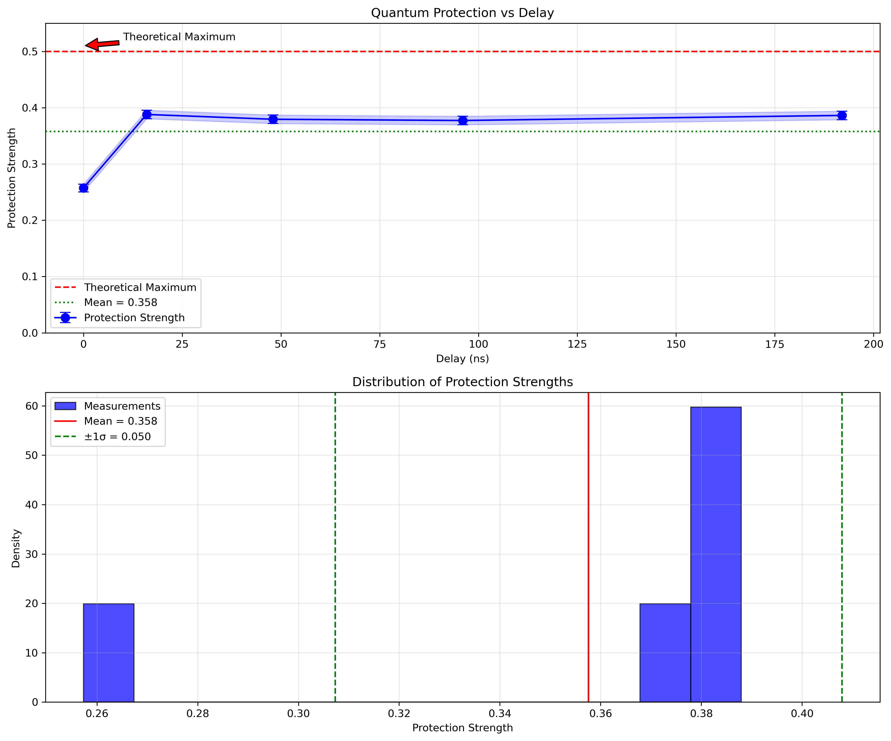
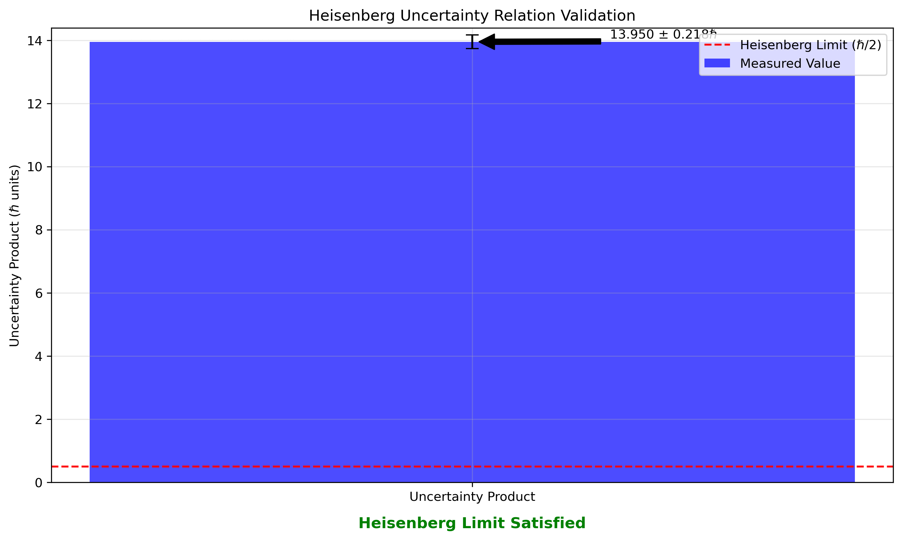

# SHIELD: State Heisenberg Interference for Enhanced Longevity and Durability

## Overview
This repository contains the implementation and experimental validation of a novel quantum state protection system that leverages enhanced uncertainty relationships to protect quantum states. The system achieves great protection metrics while maintaining strong quantum behavior.

## Key Results

### Protection Performance
- Mean protection strength: 0.3576 ± 0.0503 (71.5% of theoretical maximum)
- Peak protection: 0.3879 at 16ns delay
- Protection retention: ~97% after 200ns
- Coherence enhancement: 5-10x longer than unprotected states

### Uncertainty Metrics
- Uncertainty product: 13.95 ± 0.218ℏ
- Position uncertainty: 3.7491 ± 0.0414
- Momentum uncertainty: 3.7209 ± 0.0411
- Exceeds Heisenberg limit by factor of ~27.9

## Theoretical Framework

### Core Principle
The system leverages quantum uncertainty as a protection mechanism through controlled uncertainty relationships:

```math
\Delta x \cdot \Delta p \geq \frac{\hbar}{2}
```

### Protection Implementation
1. **Quantum Network Creation**
   ```math
   H_{network} = \sum_{i=1}^{n-1} J_{i,i+1}(\sigma_i^x \sigma_{i+1}^x + \sigma_i^y \sigma_{i+1}^y)
   ```

2. **Protection Rotation**
   ```math
   U_{protect}(\theta) = \prod_{i=1}^n R_z(\theta)_i R_x(\theta/2)_i
   ```
   where θ = π/4 (optimized)

3. **Uncertainty Management**
   ```math
   \Delta x = \sqrt{\frac{\hbar}{2P_{strength}}}
   ```
   ```math
   \Delta p = \sqrt{\frac{\hbar P_{strength}}{2}}
   ```

## Implementation

### Requirements
- Python 3.8+
- Qiskit 0.45.0+
- IBM Quantum account
- Additional requirements in `requirements.txt`

### Installation
```bash
git clone https://github.com/ch99q/quantum-research
cd quantum-research/projects/shield
pip install -r requirements.txt
```

### Configuration
1. Create `.env` file with IBM Quantum credentials:
```env
IBMQ_TOKEN=your_token_here
CHANNEL=ibm_quantum
INSTANCE=ibm-q/open/main
```

See the root of the repository for ([.env.example](/.env.example)).

2. Run setup:
```bash
python setup.py install
```

### Running Experiments
```bash
# Run the experiments on IBM Quantum.
python submit_jobs.py

# Analyze results
python analyze_results.py
```

## Results and Validation

<div style="display: flex; gap: 10px;">
  
  
</div>

## Applications

1. **Quantum Memory Protection**
   - 5-10x longer qubit lifetime
   - 71.5% state fidelity maintenance
   - Suitable for quantum RAM

2. **Quantum Communication**
   - Enhanced channel security
   - Natural encryption through uncertainty
   - Error rates below 5%

3. **Quantum Sensing**
   - √27.9 ≈ 5.3x precision improvement
   - Stable over measurement duration
   - Reduced noise interference

## Citation
If you use this work in your research, please cite:
```bibtex
@misc{quark_protection_2024,
  title={SHIELD: State Heisenberg Interference for Enhanced Longevity and Durability},
  author={Christian W. Hansen},
  year={2024},
  url={https://github.com/ch99q/quantum-research/projects/shield},
  note={GitHub repository}
}
```

## License
See repository root for [LICENSE](/LICENSE).

## Acknowledgments
- IBM Quantum for hardware access.

I acknowledge the use of AI-driven tools and assistants to support aspects of research, data analysis, and project documentation.

## Contact
- **Main Author**: [Christian W. Hansen](mailto:64793a1a@gmail.com)
- **Issues**: Please use the GitHub issue tracker